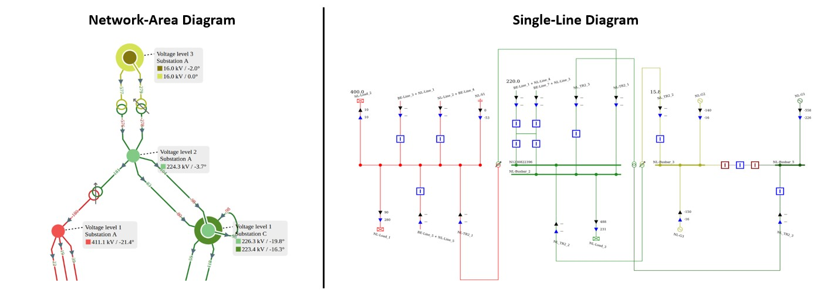

# PowSyBl Diagram

PowSyBl diagram allows users to generate customizable network graph diagrams (denominated network-area diagrams in PowSyBl) and single-line diagrams.

## PowSyBl framework

PowSyBl (**Pow**er **Sy**stem **Bl**ocks) is an open source framework written in Java, that makes it easy to write complex
software for power systems’ simulations and analysis. Its modular approach allows developers to extend or customize its
features.

PowSyBl is part of the LF Energy Foundation, a project of The Linux Foundation that supports open source innovation projects
within the energy and electricity sectors.

Read more at https://www.powsybl.org!

This project and everyone participating in it is governed by the [PowSyBl Code of Conduct](https://github.com/powsybl/.github/blob/main/CODE_OF_CONDUCT.md).
By participating, you are expected to uphold this code. Please report unacceptable behavior to [powsybl-tsc@lists.lfenergy.org](mailto:powsybl-tsc@lists.lfenergy.org).

## PowSyBl Network Area Diagram

PowSyBl Network Area Diagram is a component build on top of the `Network` model available in the PowSyBl Core repository responsible for generating a concise diagram of the whole network or of a part of the network, showing in particular the interconnections between the different voltage levels.
A network area diagram emphasizes the electrical structure of the network, and may differ substantially from the network physical geography.
It displays the graph whose nodes are the network voltage levels, and whose edges are the lines and transformers between those voltage levels.

## PowSyBl Single Line Diagram

PowSyBl Single Line Diagram is a component build on top of the `Network` model available in the PowSyBl Core repository responsible 
for generating a [single line diagram](https://en.wikipedia.org/wiki/One-line_diagram).

The main features are:
 - Node/Breaker and bus/breaker topology.
 - [SVG](https://fr.wikipedia.org/wiki/Scalable_Vector_Graphics) diagram to be used in various front-end technologies.
 - Voltage-level, substation and zone diagrams.
 - Highly customizable rendering using equipment component libraries, CSS and configurable labels (position and content).
 - Multiple layout modes: fully automatic, semi-automatic (using relative positions for busbar sections and feeders), CGMES DL.

## Getting started with PowSyBl diagram

- Have a look at the tutorials presented [here](https://www.powsybl.org/pages/documentation/developer/tutorials/):
  - Discover network-area diagrams by generating SVG files from a test network [here](*available soon*)
  - Get your hands dirty by generating your first single-line diagrams [here](https://www.powsybl.org/pages/documentation/developer/tutorials/diagram/svg-writing.html)
  - Learn how to customize your single-line diagram [here](https://www.powsybl.org/pages/documentation/developer/tutorials/diagram/sld-custom-node.html)

- Pop in [here](https://www.powsybl.org/pages/documentation/developer/api_guide/svg-writing.html) to get more examples on how to use PowSyBl diagrams!

