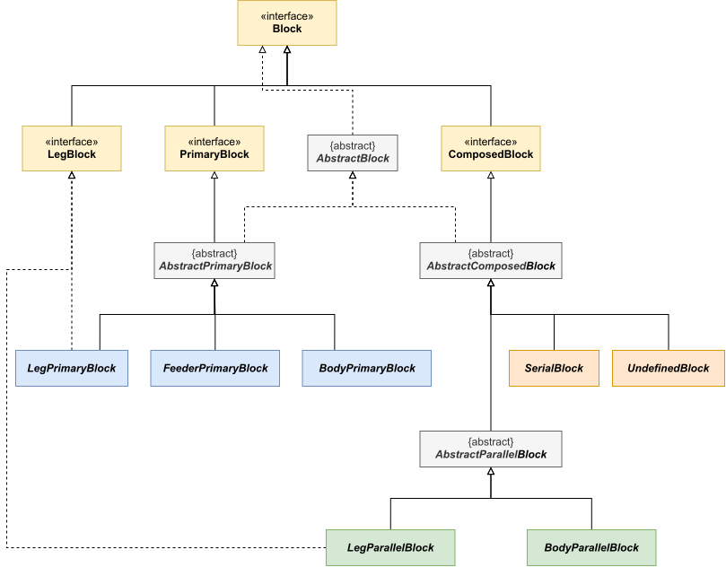
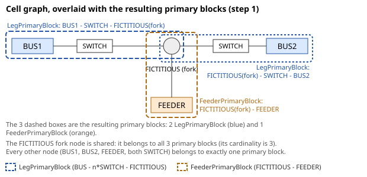
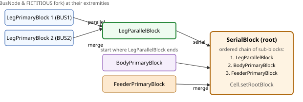

# Structure the cells into `Blocks`

Once the cells are detected (see [Cell detection](cellDetector.md)), each `BusCell` (`InternCell`, `ExternCell`, `ArchCell`)
and `ShuntCell` has to be organized into `Block` hierarchy so that a coordinate can later be computed for every node
(see [PositionFinder](positionFinder.md) and `BlockPositionner`).

Blocks are the building elements that are assembled hierarchically to organize the layout of the cells: a `Block` can
either directly embed a list of `Node`, or be composed of several sub-`Blocks`.

## The `Block` hierarchy

A `Block` is identified by a `Block.Type`:

* `LEGPRIMARY`\
  A primary block starting on a `BUS` node and going up to the first non-switch node, following the pattern
  `BUS - n*SWITCH - FICTITIOUS` (n >= 0). Such blocks instantiate `LegPrimaryBlock` and implement `LegBlock`.
* `FEEDERPRIMARY`\
  A primary block ending on a `FEEDER` node, following the pattern `FICTITIOUS - FEEDER`. Such blocks instantiate `FeederPrimaryBlock`.
* `BODYPRIMARY`\
  A primary block between two non-switch nodes that are not a `BUS` nor a `FEEDER`, following the pattern
  `FICTITIOUS - n*SWITCH - FICTITIOUS` (n >= 0). Such blocks instantiate `BodyPrimaryBlock`.
* `LEGPARALLEL`\
  Several `LegPrimaryBlock` sharing the same extremities, merged together. Such blocks instantiate `LegParallelBlock`
  and implement `LegBlock`.
* `BODYPARALLEL`\
  Several blocks (of any type, except `LEGPRIMARY` alone, which would be a `LEGPARALLEL`) sharing the same extremities,
  merged together. Such blocks instantiate `BodyParallelBlock`.
* `SERIAL`\
  A chain of blocks, each one starting where the previous one ends. Such blocks instantiate `SerialBlock`.
* `UNDEFINED`\
  A fallback block gathering the remaining blocks when the algorithm could not identify any further merge
  (see [Step 2: merge the blocks](#step-2-merge-the-blocks) below). Such blocks instantiate `UndefinedBlock`.

`LEGPRIMARY`, `FEEDERPRIMARY` and `BODYPRIMARY` are said to be *primary* blocks: they are the leaves of the hierarchy and
directly embed a list of `Node`. `LEGPARALLEL` and `BODYPARALLEL` are said to be *parallel* blocks, while `SERIAL` and
`UNDEFINED` are *composed* blocks made of a list of sub-`Blocks`.

The `Block` type hierarchy, showing which types are primary/parallel/composed and which interfaces/classes they map to:

{align=center class="forced-white-background"}

The algorithm ends up building a single root `Block` per cell, stored by `Cell.setRootBlock`, on which the size and the
position of the cell will later be computed.

## Building the block hierarchy: `CellBlockDecomposer`

For each `BusCell`, the `CellBlockDecomposer.determineComplexCell` method builds the block hierarchy in two steps.

### Step 1: identify the primary blocks

Starting from each `BUS` node of the cell, the algorithm walks along the chains of `SWITCH` nodes until it reaches a
non-switch node, creating one `LegPrimaryBlock` per branch. It does the same starting from each `FEEDER` node, creating
one `FeederPrimaryBlock` per branch. The remaining chains of nodes (not starting on a `BUS` or ending on a `FEEDER`) are
then explored recursively to create the `BodyPrimaryBlock` instances, until every node of the cell has been assigned to
exactly as many primary blocks as its cardinality allows (a node shared by several blocks, e.g. a fork node, can belong
to several primary blocks).

A small cell graph and the resulting set of primary blocks (`LegPrimaryBlock`, `FeederPrimaryBlock`) it is decomposed
into, sharing the fork `FICTITIOUS` node:

{align=center class="forced-white-background"}

### Step 2: merge the blocks

The primary blocks are then merged together, repeatedly, until only one block remains:

* **Parallel merge**: two blocks are parallel if they share the same two extremity nodes (in the same order or reversed).
  All the blocks found to be parallel to one another are merged into a single `LegParallelBlock` (if they are all
  `LegPrimaryBlock`) or `BodyParallelBlock` (otherwise).
* **Serial merge**: a chain of blocks, each one starting where the previous one ends, is merged into a single `SerialBlock`.

Both kinds of merge are attempted alternately until no more blocks can be merged. If, at some point, none of the two
merges can be applied while several blocks remain, the remaining blocks are gathered into an `UndefinedBlock`: this
means the pattern of the cell is not handled by the algorithm (this can be turned into an exception thanks to the
`exceptionIfPatternNotHandled` parameter, see [`PositionVoltageLevelLayoutFactoryParameters`](layout.md#the-positionvoltagelevellayoutfactoryparameters-class)).

The merge of two `LegPrimaryBlock` into a `LegParallelBlock`, then its serial merge with a `FeederPrimaryBlock` into the
final `SerialBlock` root:

{align=center class="forced-white-background"}

## Shunt cells

`ShuntCell` cells are simpler to handle: `CellBlockDecomposer.determineShuntCellBlocks` directly builds a single
`BodyPrimaryBlock` containing all the nodes of the cell.
