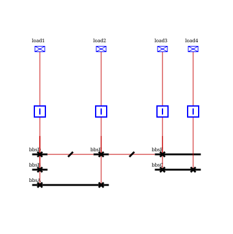

# HorizontalBusList

A `HorizontalBusList` is an ordered sequence of positions occupied by `BusNode`s that are displayed horizontally at the
same vertical position (`vPos`) in a `BSCluster`.

It is composed of:

- an ordered `busNodes` list. An element can be `null` when the list has a gap at that position;
- a zero-based `startingIndex`, the horizontal position of the first element in the containing `BSCluster`;
- a conceptual `length`, equal to `busNodes.size()`. The list occupies the half-open interval
  `[startingIndex, getEndingIndex())`, where `getEndingIndex()` is `startingIndex + length`. Consequently, its last
  position is `getEndingIndex() - 1` (when the list is not empty).

The indexes of a `HorizontalBusList` refer to positions in the `BSCluster`, whose columns are the `VerticalBusSet`s.
The same `BusNode` can therefore occur at several contiguous positions in a list when it spans several `VerticalBusSet`s.

A `HorizontalBusList` is initially created with one `BusNode` for each bus node of a `VerticalBusSet`, when a `BSCluster`
is built (see [BSCluster](bsCluster.md#build)). When two clusters are merged, the selected `HorizontalBusListsMerger`
decides which lists to merge. `HorizontalBusList.merge` appends another list, inserting either the common side node or
`null` for positions between the two lists when necessary. Lists with no matching bus node remain separate and are shifted
by the length of the left cluster.

After the lists have been organized, `BSCluster.establishBusNodePosition` assigns the list's vertical `busbarIndex` (`v`)
and an increasing horizontal `sectionIndex` to each non-null list entry. Repeated occurrences of the same bus node represent
one bus bar spanning several positions; the final `sectionIndex` assigned to that object is the one from its last occurrence.
`null` entries do not represent bus nodes.

The list also supports reversing its order when a cluster is reversed, shifting its starting position, retrieving the node
at a cluster position, and retrieving its left or right side node. These operations are used by the position-finder
implementations while clusters are merged.

A `BSCluster` with 3 `HorizontalBusList` stacked vertically, illustrating the `startingIndex`/`length` of each list,
a `BusNode` spanning over several positions, and a `null` gap between two `BusNode`. Those lists relate to the final
`(h,v)` `BusNode` positions (see [Position of `BusNodes` and `Cells` order](positionFinder.md)):

{align=center class="forced-white-background"}
