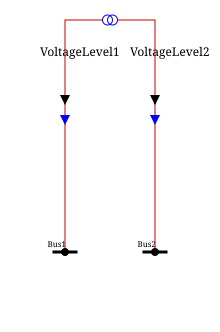
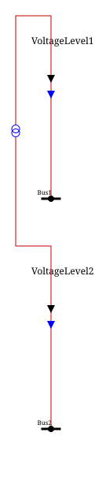

# Layouts

```{toctree}
---
maxdepth: 2
hidden: true
---

graphRefiner.md
cellDetector.md
cellBlockDecomposer.md
positionFinder.md
zoneLayouts.md
```

A layout represents the way in which the elements of a graph are arranged.

It is possible to use your own graph layout implementation, but there are also existing layouts in powsybl-diagram, ready to use.


## Layouts for voltage levels

### Existing implementations

#### PositionVoltageLevelLayout

This layout positions the different elements inside a voltage level according to the following process:

- Clean the graph to have the expected patterns (see [Graph Refiner](graphRefiner.md))
- Detect the cells (intern / extern / shunt) (see [Cell detection](cellDetector.md))
- Organize the cells into blocks (see [CellBlockDecomposer](cellBlockDecomposer.md))
- Compute real coordinates of busNode and blocks connected to busbars (see [PositionFinder](positionFinder.md))

##### The `PositionVoltageLevelLayoutFactoryParameters` class

This class gathers the parameters that customize the way `PositionVoltageLevelLayout` behaves, from the preliminary
graph cleaning (see [Graph Refiner](graphRefiner.md)) to the block/position computation (see
[CellBlockDecomposer](cellBlockDecomposer.md) and [PositionFinder](positionFinder.md)):

* `feederStacked` (default `true`): whether `LegPrimaryBlock` sharing the same non-bus extremity should be detected and
  marked as stackable, so that the corresponding feeders can later be stacked on top of each other instead of being
  spread out horizontally.
* `removeUnnecessaryFictitiousNodes` (default `true`): whether the `GraphRefiner` should remove the redundant
  `FICTITIOUS` nodes of the graph (i.e. nodes with only two adjacent edges that can be bypassed with a single edge).
* `substituteSingularFictitiousByFeederNode` (default `true`): whether the `GraphRefiner` should replace `INTERNAL`
  nodes having a single neighbor by a fictitious `FeederNode`.
* `substituteInternalMiddle2wtByEquipmentNodes` (default `true`): whether the `GraphRefiner` should replace, by simple
  `EquipmentNode`, the feeder/middle nodes of a two-winding transformer whose both ends are in the same voltage level,
  in order to avoid unnecessary snake lines.
* `exceptionIfPatternNotHandled` (default `false`): whether an exception should be thrown when the block decomposition
  algorithm cannot fully merge the blocks of a cell (see [CellBlockDecomposer](cellBlockDecomposer.md)); when `false`,
  the remaining blocks are simply gathered into an `UndefinedBlock` and the diagram building continues.
* `handleShunts` (default `false`): whether `PositionFinder` implementations should take `ShuntCell` into account
  when computing the `List<Subsection>` (see [Subsection](subsection.md)).
* `busInfoMap` (default empty): a map giving, for some `BusNode` ids, on which `Side` (`LEFT`/`RIGHT`) extra information
  about the bus should be displayed; this is taken into account by `BlockPositionner` to reserve the corresponding space.

##### The `PositionFinder` class

The `PositionFinder` interface, and its available implementations (`PositionFromExtension` and `PositionByClustering`),
are described in a dedicated page: see [Position of `BusNodes` and `Cells` order](positionFinder.md).

#### RandomVoltageLevelLayout

With this layout, the graph node coordinates are randomly fixed:
- Between 0 and `width` for the x coordinate;
- Between 0 and `height` for the y coordinate.
The `width` and `height` variables are provided by the user.

#### CgmesVoltageLevelLayout

With this layout, the elements of the graph are arranged according to the data included in the CGMES DL profile.

### Choosing a `VoltageLevelLayout`

The `voltageLevelLayoutFactoryCreator` attribute in the [`SldParameters`](../sld_parameters.md) class is the customization parameter to use to choose a specific `VoltageLevelLayout`.

The `VoltageLevelLayoutFactoryCreator` creates a `VoltageLevelLayoutFactory` which in turn creates a `VoltageLevelLayout`.

#### Choose a specific PositionVoltageLevelLayout

Static methods are available in the `VoltageLevelLayoutFactoryCreator` interface to help users manipulate those objects.

Some examples are shown below.

__Example 1__

PositionVoltageLevelLayout using default parameters:

```java
VoltageLevelLayoutFactoryCreator voltageLevelLayoutFactoryCreator = VoltageLevelLayoutFactoryCreator.newPositionVoltageLevelLayoutFactoryCreator();
SldParameters sldParameters = new SldParameters().setVoltageLevelLayoutFactoryCreator(voltageLevelLayoutFactoryCreator);
```

__Example 2__

PositionVoltageLevelLayout with a chosen [`PositionFinder`](#the-positionfinder-class):

```java
VoltageLevelLayoutFactoryCreator voltageLevelLayoutFactoryCreator = VoltageLevelLayoutFactoryCreator.newPositionVoltageLevelLayoutFactoryCreator(positionFinder);
SldParameters sldParameters = new SldParameters().setVoltageLevelLayoutFactoryCreator(voltageLevelLayoutFactoryCreator);
```

__Example 3__

PositionVoltageLevelLayout with chosen [`PositionVoltageLevelLayoutFactoryParameters`](#the-positionvoltagelevellayoutfactoryparameters-class):

```java
VoltageLevelLayoutFactoryCreator voltageLevelLayoutFactoryCreator = VoltageLevelLayoutFactoryCreator.newPositionVoltageLevelLayoutFactoryCreator(positionVoltageLevelLayoutFactoryParameters);
SldParameters sldParameters = new SldParameters().setVoltageLevelLayoutFactoryCreator(voltageLevelLayoutFactoryCreator);
```

__Example 4__

PositionVoltageLevelLayout with a chosen [`PositionFinder`](#the-positionfinder-class) and chosen [`PositionVoltageLevelLayoutFactoryParameters`](#the-positionvoltagelevellayoutfactoryparameters-class):

```java
VoltageLevelLayoutFactoryCreator voltageLevelLayoutFactoryCreator = VoltageLevelLayoutFactoryCreator.newPositionVoltageLevelLayoutFactoryCreator(positionFinder, positionVoltageLevelLayoutFactoryParameters);
SldParameters sldParameters = new SldParameters().setVoltageLevelLayoutFactoryCreator(voltageLevelLayoutFactoryCreator);
```

#### Use the `SmartVoltageLevelLayoutFactory`

The SmartVoltageLevelLayoutFactory picks the "best" `VoltageLevelLayout` according to the information available in the network.

There is also a static method in the `VoltageLevelLayoutFactoryCreator` interface to help users pick the `SmartVoltageLevelLayoutFactory`:

```java
VoltageLevelLayoutFactoryCreator voltageLevelLayoutFactoryCreator = VoltageLevelLayoutFactoryCreator.newSmartVoltageLevelLayoutFactoryCreator();
SldParameters sldParameters = new SldParameters().setVoltageLevelLayoutFactoryCreator(voltageLevelLayoutFactoryCreator);
```

## Layouts for substations

A substation layout arranges, relative to one another, the `VoltageLevelGraph` of the different `VoltageLevel` of a
substation (each one already laid out thanks to a `VoltageLevelLayout`), and computes the snake lines connecting them
(the edges of the `SubstationGraph`, see [GraphBuilder creation requirements](../model/graphBuilderCreationRequirements.md#substationgraph)).

### Existing implementations

#### HorizontalSubstationLayout

With this layout, the `VoltageLevelGraph` are placed side by side horizontally, ordered as they were added to the 
`SubstationGraph` (by default, `NetworkGraphBuilder` adds them by descending nominal voltage), and vertically aligned according to the
`LayoutParameters.getBusbarsAlignment()` parameter (aligning on the first, the last, or the middle busbar section, or
without any alignment).

<div style="width:50%; margin: auto;">


</div>

#### VerticalSubstationLayout

With this layout, the `VoltageLevelGraph` are stacked vertically, ordered as they appear in the `SubstationGraph`
(i.e. by descending nominal voltage), each one below the previous one.

<div style="width:20%; margin: auto;">


</div>

### Choosing a `SubstationLayout`

The `substationLayoutFactory` attribute in the [`SldParameters`](../sld_parameters.md) class is the customization
parameter to use to choose a specific `SubstationLayout`: it takes a `SubstationLayoutFactory`, either a
`HorizontalSubstationLayoutFactory` (the default) or a `VerticalSubstationLayoutFactory`.

```java
SldParameters sldParameters = new SldParameters().setSubstationLayoutFactory(new VerticalSubstationLayoutFactory());
```

## Layouts for multi-substation graphs

Multi-substation graphs can use a matrix-like layout for the different substations.
See [Zone Matrix Layout](zoneLayouts.md) for more details.
