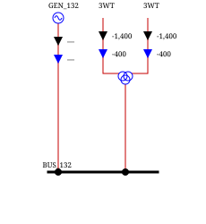
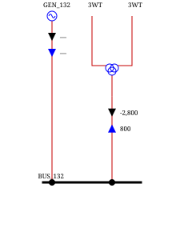
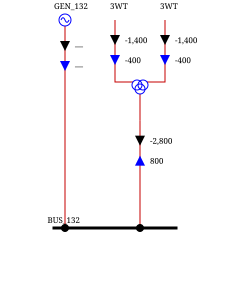

# Layout Parameters

Layout parameters are parameters that are common to all layouts.

## Parameters available

<h4 style="color:red">TODO: complete missing parameters</h4>

`threeWindingsTransformerFeederInfoMode`: Defines on which leg of the three-winding transformer power and current arrows are displayed.
Possible values are:
- `ONLY_OUTSIDE_VOLTAGE_LEVEL` (default): display on the two outer legs of the three-winding transformer.
- `ONLY_INSIDE_VOLTAGE_LEVEL`: display on the inner leg of the three-winding transformer.
- `FULL_3WT`: display on all three legs of the three-winding transformer.

To set, use the `setThreeWindingsTransformerFeederInfoMode` method.

| 
{class="forced-white-background"}
 | 
{class="forced-white-background"}
 | 
{class="forced-white-background"}
 |
|:---------------------------------------------------------------------------------------------------------------------------------------------------------------------------:|:-------------------------------------------------------------------------------------------------------------------------------------------------------------------------:|:--------------------------------------------------------------------------------------------------------------------------------------------------------------------:|
|                                                                    Default (ONLY_OUTSIDE_VOLTAGE_LEVEL)                                                                     |                                                                         ONLY_INSIDE_VOLTAGE_LEVEL                                                                         |                                                                               FULL_3WT                                                                               |

Note that adding arrows to the internal leg of the three-winding transformer will increase the height of all vertical feeders of that voltage level by the span of the arrows.
