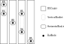

## Position of `BusNodes` and `Cells` order

```{toctree}
---
maxdepth: 2
hidden: true
---

bsCluster.md
positionFromExtension.md
positionByClustering.md
subsection.md
```

### Definitions and goal

Positioning the `BusNodes` and determination of the `ExternalCells` order are performed by implementing the `PositionFinder` interface.

The goal is to:

* set the horizontal and vertical **structural _(h,v)_** `BusNode.structuralPosition`
* set the horizontal **order** of the cells: `Cell.order`
* provide a `List<Subsection>`. See [Subsection](subsection.md).

The picture hereafter shows the information that is to be established.

{align=center class="forced-white-background"}
**_(h,v) positions of `BusNodes` and `ExternCell` cells order_**

### Available implementations

Two implementations are available:

* `PositionFromExtension` which rely on explicitly given positions (for example, to reflect the on-site real structure and/or the way the SCADA organizes it). See [PositionFromExtension](positionFromExtension.md)
* `PositionByClustering` which finds an organization of the `VoltageLevel` with no other information than the graph itself. See [PositionByClustering](positionByClustering.md)

Both rely on the `BSCluster` (see [BSCluster](bsCluster.md)) and have the same skeleton:

* Step 1: Build of `VerticalBusSets`
* Step 2: Build of unitary `BSCluster` in the `bsClusters` list
* Step 3: Merge of `bsClsuters` into a single `BSCluster`
* Step 4: Build of the `List<Subsection>subsections`

### Illustration of algorithms based on `BSCluster`

The illustration will be based on the following graph and shall result in the above layout.

{align=center class="forced-white-background"}

#### Step 1: Build `VerticalBusSets`

The result of `VerticalBusSet.createVerticalBusSets` is

| VerticalBusSet | BusNodes | ExternCells   | InternCellSides |
|----------------|----------|---------------|-----------------|
| vbs-1          | B3, B1   | EC1           | IC2.R, IC3.L    |
| vbs-2          | B2       |               | IC1.L           |
| vbs-3          | B1, B4   | EC2, EC3, EC4 | IC3.R           |
| vbs-4          | B5       |               | IC1.R, IC2.L    |

> **Note:** At that stage, the `LEFT` and `RIGHT` side of an `InternCell` is arbitrary. They will be flipped if necessary later on (handled in `Subsection.createSubsections`).

#### Step 2: Build unitary `BSClusters`

This consist in creating one `BSCluster` per `VerticalBusSet`. This results in:

| BSCluster | VerticalBusSets                              | HorizontalBusLists |
|-----------|----------------------------------------------|--------------------|
| bsc-1     | [ ( [B3, B1] , [EC1] , [IC2.R, IC3.L] ) ]    | [ [B3] , [B1] ]    |
| bsc-2     | [ ( [B2] , , [IC1.L] ) ]                     | [ [B2] ]           |
| bsc-3     | [ ( [B1, B4] , [EC2, EC3, EC4] , [IC3.R] ) ] | [ [B1], [B4] ]     |
| bsc-4     | [ ( [B5] , , [IC1.L , IC2.L] ) ]             | [ [B5] ]           |

{align=center class="forced-white-background"}

> **Important - On this result:**
> - It is representative of the general case. But note that for `PositionFromExtension`, the `verticalBusSets` is sorted to end up to a ready-to-merge `bsClusters`. See [PositionFromExtension](positionFromExtension.md).
> - In this picture, the `NodeBus` are on different rows to show that they are not necessarily aligned. Only both `B1` will necessarily be on the same row.

#### Step 3: Merge `BSClusters` into a single one

That's where the magic happens. This is where the implementations mainly differ. The goal is to merge the `BSClusters` to one another.

The principle of the merging of a `BSCluster` are:

- simply concat the `VerticalBusSet` List
- merge the `HorizontalBusList` using a proper implementation of `HorizontalBusLane::mergeHbl`.

This expected result should be similar to the following `BSCluster`:

{align=center class="forced-white-background"}

| VerticalBusSets                                                                                                                                                    | HorizontalBusLists                                         |
|--------------------------------------------------------------------------------------------------------------------------------------------------------------------|------------------------------------------------------------|
| [ <br><br> ( [B2, B5] , , [IC1.L, IC1.R, IC2.L] ) , <br><br> ( [B4, B1] ,  [EC2, EC3, EC4] , [IC3.R] ) , <br><br> ( [B3, B1] , [EC1] , [IC2.R, IC3.L] ) <br><br> ] | [ <br><br> [B2, B4, B3] , <br><br> [B5, B1, B1] <br><br> ] |

The way this example is handled is detailed in each implementation documentation: [PositionFromExtension](positionFromExtension.md), [PositionByClustering](positionByClustering.md).

#### Step 4: Build the `List<Subsection>`

See [Subsection](subsection.md).
