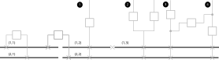
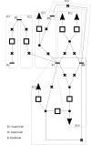
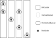

# PositionFinder

```{toctree}
---
maxdepth: 2
hidden: true
---

bsCluster.md
positionPredefined.md
positionByClustering.md
subsection.md
```

## Definitions and goal

The positioning of the `BusNodes` and the determination of the order and direction of the cells connected to a bus (i.e. all
cells except `ShuntCell`) are performed by implementing the `PositionFinder` interface:

```java
List<Subsection> buildLayout(VoltageLevelGraph graph, boolean handleShunt);
```

The goal is to:

* set the **structural** vertical and horizontal position of the `BusNodes`, i.e. their `busbarIndex` (which busbar row they belong to) and `sectionIndex` (their order within that row), through `BusNode.setBusBarIndexSectionIndex`. These indices are later used (outside `PositionFinder`, in `BlockPositionner`) to compute the actual `h,v` `Position` of the `BusNodes` (`BusNode.setPosition`).
* set the horizontal **order** and the **direction** (`TOP`/`BOTTOM`) of the `BusCells` (`ExternCell` order, `Cell` direction, ...)
* provide a `List<Subsection>`. See [Subsection](subsection.md).

The `handleShunt` parameter, when `true`, tells the underlying `Subsection::createSubsections` (see below) to also take
`ShuntCell` into account when computing the `List<Subsection>`.

The picture hereafter shows the information that is to be established.

{align=center class="forced-white-background"}
**_(h,v) positions of `BusNodes` and `ExternCell` cells order_**

## Available implementations

Two implementations are available:

* `PositionPredefined` which relies on explicitly given positions (for example, to reflect the on-site real structure and/or the way the SCADA organizes it). See [PositionPredefined](positionPredefined.md)
* `PositionByClustering` which finds an organization of the `VoltageLevel` with no other information than the graph itself. See [PositionByClustering](positionByClustering.md)

Both rely on the `BSCluster` (see [BSCluster](bsCluster.md)) and extend the same `AbstractPositionFinder` class, which
implements `buildLayout` as a template method relying on 3 abstract methods that each implementation has to provide:

* `indexBusPosition`, which builds the `Map<BusNode, Integer> busToNb` used to order the `BusNodes` inside a `VerticalBusSet` (see step 1 below),
* `organizeBusSets`, which builds the initial `List<BSCluster>` (one per `VerticalBusSet`) and merges them into a single `BSCluster` (see steps 2 and 3 below),
* `organizeDirections`, which, once the `List<Subsection>` is built (see step 4 below), finalizes the direction of the cells (for example, aligning the `ExternCells` linked by a `ShuntCell`).

This results in the following common skeleton:

* Step 1: Build of `VerticalBusSets`
* Step 2: Build of unitary `BSCluster` in the `bsClusters` list
* Step 3: Merge of `bsClusters` into a single `BSCluster`
* Step 4: Build of the `List<Subsection>subsections`
* Step 5: Organize the direction of the cells

Steps 1 and 4 are common to both implementations (respectively provided by `VerticalBusSet::createVerticalBusSets` and
`Subsection::createSubsections`), while steps 2, 3 and 5 are specific to each implementation, as detailed below.

## Illustration of algorithms based on `BSCluster`

The illustration will be based on the following graph and shall result in the above layout.

{align=center class="forced-white-background"}

### Step 1: Build `VerticalBusSets`

The result of `VerticalBusSet.createVerticalBusSets` is

| VerticalBusSet | BusNodes | ExternCells   | InternCellSides |
|----------------|----------|---------------|-----------------|
| vbs-1          | B3, B1   | EC1           | IC2.R, IC3.L    |
| vbs-2          | B2       |               | IC1.L           |
| vbs-3          | B1, B4   | EC2, EC3, EC4 | IC3.R           |
| vbs-4          | B5       |               | IC1.R, IC2.L    |

> **Note:** At that stage, the `LEFT` and `RIGHT` side of an `InternCell` is arbitrary. They will be flipped if necessary later on (handled in `Subsection.createSubsections`).

### Step 2: Build unitary `BSClusters`

This consist in creating one `BSCluster` per `VerticalBusSet`. This results in:

| BSCluster | VerticalBusSets                              | HorizontalBusLists |
|-----------|----------------------------------------------|--------------------|
| bsc-1     | [ ( [B3, B1] , [EC1] , [IC2.R, IC3.L] ) ]    | [ [B3] , [B1] ]    |
| bsc-2     | [ ( [B2] , , [IC1.L] ) ]                     | [ [B2] ]           |
| bsc-3     | [ ( [B1, B4] , [EC2, EC3, EC4] , [IC3.R] ) ] | [ [B1], [B4] ]     |
| bsc-4     | [ ( [B5] , , [IC1.R , IC2.L] ) ]             | [ [B5] ]           |

{align=center class="forced-white-background"}

> **Important - On this result:**
> - It is representative of the general case. But note that for `PositionPredefined`, the `verticalBusSets` is sorted to end up to a ready-to-merge `bsClusters`. See [PositionPredefined](positionPredefined.md).
> - In this picture, the `NodeBus` are on different rows to show that they are not necessarily aligned. Only both `B1` will necessarily be on the same row.

### Step 3: Merge `BSClusters` into a single one

That's where the magic happens. This is where the implementations mainly differ. The goal is to merge the `BSClusters` to one another.

The principle of the merging of a `BSCluster` is:

- simply concatenate the `VerticalBusSet` lists (the `VerticalBusSets` themselves are never merged together, they just get appended to one another)
- merge the `HorizontalBusList` using a proper implementation of `HorizontalBusListsMerger::apply`.

The expected result, once all the `bsClusters` have been merged into a single one, should be similar to the following `BSCluster`:

{align=center class="forced-white-background"}

| VerticalBusSets                                                                                                                                                | HorizontalBusLists                                      |
|----------------------------------------------------------------------------------------------------------------------------------------------------------------|---------------------------------------------------------|
| <ul><li> ( [B2, B5] , , [IC1.L, IC1.R, IC2.L] ) </li><li> ( [B4, B1] ,  [EC2, EC3, EC4] , [IC3.R] ) </li><li> ( [B3, B1] , [EC1] , [IC2.R, IC3.L] ) </li></ul> | <ul><li> [B2, B4, B3] </li><li> [B5, B1, B1] </li></ul> |

Once the final `BSCluster` is ready, `BSCluster.establishBusNodePosition` iterates over its `HorizontalBusLists` (one per
row) and calls `HorizontalBusList.establishBusPosition`, which sets, on each `BusNode` of the row, its `busbarIndex`
(the row index) and `sectionIndex` (its order inside that row). Note that `PositionPredefined` does not need this step,
since it relies on `busbarIndex`/`sectionIndex` already set on the `BusNodes` (see [PositionPredefined](positionPredefined.md)).

The way this example is handled, step by step, is detailed in each implementation documentation: [PositionPredefined](positionPredefined.md#step-3-merge-of-bsclusters-into-a-single-one), [PositionByClustering](positionByClustering.md#step-3-merge-of-bsclusters-into-a-single-one).

### Step 4: Build the `List<Subsection>`

Done by calling `Subsection::createSubsections`, passing it the `handleShunt` parameter received by `buildLayout`. See [Subsection](subsection.md).

### Step 5: Organize the direction of the cells

Once the `List<Subsection>` is built, each implementation of `PositionFinder` finalizes, in its own `organizeDirections`
method, the `Direction` (`TOP`/`BOTTOM`) of the cells that could not be safely decided earlier (typically to keep the
`ExternCells` linked by a `ShuntCell` consistent with one another).
