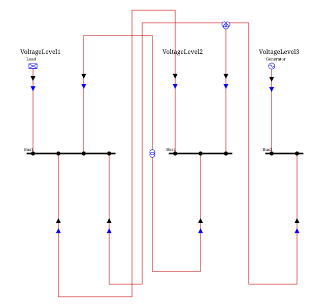

## Requirements for implementing a custom GraphBuilder

Implementing a GraphBuilder is the way to build the graph to be rendered by SingleLineDiagram.
This shall implement builder for `VoltageLevelGraph`, `SubstationGraph` and `ZoneGraph`.
Here are some hints that are to be considered.

### VoltageLevelGraph

A `VoltageLevelGraph` is made of nodes that extend the `model.nodes.Node` class.
The `Node` holds an `NodeType` enum that can take the following values:

* `BUS`: representing the BusBar, rendered as one straight horizontal line. The `BusNode` class extending `Node` is initialized with this value
* `FEEDER`: representing what connect the VoltageLevel to the outside, rendered on top or bottom of the voltageLevel.
  The `FeederNode` class extending `Node` is initialized with this value
* `INTERNAL` and `SWITCH`: representing nodes that constitute the graph connecting the Buses and the Feeders. 
  Note that only the `SwitchNode` class should be initialized with `SWITCH`.

The graph shall be built:

* using `graph.NodeFactory` class for creating nodes. There are factories for each kind of nodes.
  If new nodes are needed, ensure to add the created node to the graph appropriately.
* connecting them with `VoltageLevelGraph.addEdge`

#### Components

Each node has a `componentTypeName` that is related to a `ComponentLibrary`.

* an easy way to add nodes with components that are not in the NodeFactory is to create a Node with `NodeFactory.createNode`.  
See `test.raw.TestAddExternalComponent`.
* Nodes that are to be drawn connected to a BusBar shall have this ability.
  No need to care about that rule as an adapted node (a `Node` with `BUS_CONNECTION` component) will be inserted between
  the bus and the node if the node is not directly connected to the bus. 
  Note that:
    * This ability is given to some components in `layout.LayoutParameters.componentsOnBusbars`.
      By default, this is set with `DISCONNECTOR` (`BUS_CONNECTION` is implicit as it is necessary for the algorithm to work).
    * The `BUS_CONNECTION` component is the one that will be inserted if the component connected to the bus doesn't have this ability.
      Therefore, ensure the `ComponentLibrary` contains the `BUS_CONNECTION` component.

### SubstationGraph

A `SubstationGraph` is made of the `VoltageLevelGraph` of each `VoltageLevel` of the substation, plus the edges
(the future "snake lines") that connect nodes belonging to different `VoltageLevelGraph`.

The graph shall be built:

* using `SubstationGraph.create` to create the graph, then `SubstationGraph.addVoltageLevel` to add each `VoltageLevelGraph`
  (built as described in [VoltageLevelGraph](#voltagelevelgraph), giving the `SubstationGraph` as `parentGraph`);
* connecting the `VoltageLevelGraph` together:
  * a `Line` or a `TieLine` internal to the substation but crossing two `VoltageLevel` is represented by connecting, with
    `SubstationGraph.addLineEdge`, the two `FeederNode` (one per side) already created in their respective `VoltageLevelGraph`;
  * a two-winding or three-winding transformer crossing two (resp. three) `VoltageLevel` of the substation is represented
    by creating, with `NodeFactory.createMiddle2WTNode` (resp. `NodeFactory.createMiddle3WTNode`), a middle node connected
    to the `FeederNode` of each side, already created in their respective `VoltageLevelGraph`.

{align=center class="forced-white-background"}

### ZoneGraph

A `ZoneGraph` is made of the `SubstationGraph` of each substation of the zone, plus the edges that connect nodes
belonging to different `SubstationGraph` (lines and HVDC lines between substations of the zone).

The graph shall be built:

* using `ZoneGraph.create` to create the graph, then `ZoneGraph.addSubstation` to add each `SubstationGraph`
  (built as described in [SubstationGraph](#substationgraph), giving the `ZoneGraph` as `parentGraph`);
* connecting the `SubstationGraph` together:
  * a `Line` or a `TieLine` between two substations of the zone is represented by connecting, with `ZoneGraph.addLineEdge`,
    the two `FeederNode` (one per side) already created in their respective `VoltageLevelGraph`;
  * an HVDC line between two substations of the zone is represented similarly, connecting the two converter station
    `FeederNode`.

