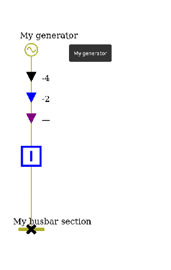

# SVG Parameters

The SLD `SvgParameters` is the configuration class to determine how to customize the SVG render of a single line diagram.
The way to integrate it is to set a `SvgParameters` value object to a `SldParameters` before drawing the SVG.

Use example:
```java
SvgParameters svgParams = new SvgParameters();
SldParameters sldParams = new SldParameters().setSvgParameters(svgParams);
SingleLineDiagram.draw(network, "VL1", Path.of("/tmp/vl1.svg"), sldParams);
```
## Identifier and naming parameters

### prefixId
Default value: is empty

The prefix to set on SVG generated identifiers (attributes ids and xml elements (cells)). It is useful to distinct id collapsing when several SVG are displayed on the same HTML page.

### useName
Default value: `false`

Boolean value to determine whether we identify an equipment node (`EquipmentNode`) by its id or its name. When set to `true` the identification is based on the name.

### diagramName
Default value: `null`

The diagram name to display in the title or SVG header

## Value formatter parameters
The `ValueFormatter` consumes some of the `SvgParameters`, related to the value precision and language to format electrical values to display.

### powerValuePrecision
Default value: `0`

Number of decimals for active and reactive power display (in kV).
```java
svgParams.setPowerValuePrecision(2);
```
{class="forced-white-background svg-height"}
{class="forced-white-background svg-height"}


### voltageValuePrecision
Default value: `1`

Number of decimals for voltage display (in kV).

### currentValuePrecision
Default value: `0`

Number of decimals for current display (in A or kA, depending on `currentUnit` value).

### angleValuePrecision
Default value: `1`

Number of decimals for phase angles display (in degrees °).

### percentageValuePrecision
Default value: `0`

Number of decimals for percentage display (power report rate, etc..).

### languageTag
Default value: `en`

Language tag to dertermine the `Locale` used for number formatting (decimal separator, etc...)

### undefinedValueSymbol 
Default value: `\u2014` (`—`) (em dash unicode for undefined value)

Symbol to display in place of a numerical value when that value is not defined (e.g. for undefined current, power, angle, percentage, voltage values for use cases: power flow not calculated, sensor missing).

## Units parameters
### currentUnit
Default value: is empty

Unit suffix displayed after active power values. Examples: "A", "kA".
init_current_arrow.svg

```java
svgParams.setCurrentUnit("A");
```
{class="forced-white-background svg-height"}
{class="forced-white-background svg-height"}

### activePowerUnit
Default value: is empty

Unit suffix displayed after current values. Examples: "MW", "kW".
```java
svgParams.setActivePowerUnit("MW");
```
{class="forced-white-background svg-height"}
{class="forced-white-background svg-height"}

### reactivePowerUnit
Default value: is empty

Unit suffix displayed after current values. Examples: "MVAR", "kVAR".
```java
svgParams.setReactivePowerUnit("MVAR");
```
{class="forced-white-background svg-height"}
{class="forced-white-background svg-height"}


## Margin and spacing parameters


### busInfoMargin
Default value: `0.0`

Horizontal offset of the busInfo (info about the busbar state) indicator related to the busbar. Can be negative in order to offset to the left. Useful for avoiding overlaps with other graphical elements.

### feederInfosIntraMargin
Default value: `10`

Vertical spacing between data of a same feeder.  
For instance, is P and Q are displayed then the distance between both values is set by this parameter.

```java
svgParams.setFeederInfosIntraMargin(50);
```
{class="forced-white-background svg-height"}
{class="forced-white-background svg-height"}

### feederInfosOuterMargin
Default value: `20`

External spacing between the equipment symbol (breaker, transformer, generator...) and the beginning of the feeder data block (active and reactive power...).

```java
svgParams.setFeederInfosOuterMargin(50);
```
{class="forced-white-background svg-height"}
{class="forced-white-background svg-height"}

## Labeling and tagging parameters

### angleLabelShift
Default value: `15.`

On the tag informing the phase angle and voltage of a busbar (voltage level node), shift to apply between both values (in SVG unit).  

```java
svgParams.setAngleLabelShift(45);
```

### labelCentered
Default value: `false`

When `true` equipments tags are centered.  
When `false` equipments tags are aligned on the left or following the renderer position rules.

```java
svgParams.setLabelCentered(true);
```
{class="forced-white-background svg-height"}
{class="forced-white-background svg-height"}

### labelDiagonal
Default value: `false`

When `true` equipments tags are displayed diagonally (45° rotation). Useful for substations with many feeders to avoid text overlaps.

```java
svgParams.setLabelDiagonal(true);
```
{class="forced-white-background svg-height"}
{class="forced-white-background svg-height"}


## SVG rendering parameters

### cssLocation
Default value: `CssLocation.INSERTED_IN_SVG`

Controls where and how the CSS is integrated within the generated SVG when adding the style in the `SvgWriter`. 3 modes available: 
- `INSERTED_IN_SVG`: directly in the SVG via a `<style>` tag (recommended for standalone exports)
- `EXTERNAL_IMPORTED`: external style sheets file referenced in a `<style>` tag from the SVG thanks to an `@import` url. Requires the CSS to be accessible via the referenced URL. Useful for web integrations with dynamic themes.
- `EXTERNAL_NO_IMPORT`: no CSS style integrated or imported. The style sheets file must be related to the integration environment (via `<link>` in the HTML parent).

```java
svgParams.setCssLocation(SvgParameters.CssLocation.EXTERNAL_NO_IMPORT);
```

### svgWidthAndHeightAdded
Default value: `false`

Used in the default SVG writer.  
When `true`, `width` and `height` attributes are added to the root `<svg>` tag and set with the diagram width and height.  
When `false` viewBox is redefined to let the SVG more flexible for web inegration (CSS responsive).

```java
svgParams.setSvgWidthAndHeightAdded(true);
```

### avoidSVGComponentsDuplication
Default value: `false`

Used in the default SVG writer to chose between direct writing of components or creation of reusable definitions via `<defs>` tag.  
When `true` identical graphic components in SVG are defined only once with a `<defs>` tag and then reused with `<use href="...">`. It reduces the SVG file weight, usefull for big nework with multipl identical components.

```java
svgParams.setAvoidSVGComponentsDuplication(true);
```

### drawStraightWires
Default value: `false`

When `true` connections between equipments are drawn with straight lines instead of routing algorithm calculated polyline paths. The renderer is more simple but too simple for complexes schemes readability.

```java
svgParams.setDrawStraightWires(true);
```

{class="forced-white-background svg-height"}
{class="forced-white-background svg-height"}

## Displaying parameters 

### feederInfoSymmetry
Default value: `false`

When `true` feeder data are displayed symmetrically on both sides of the equipment symbol.

```java
svgParams.setFeederInfoSymmetry(true);
```

{class="forced-white-background svg-height"}
{class="forced-white-background svg-height"}

### busesLegendAdded
Default value: `false`

When `true` a busbar legend is added to the diagram, explaining the mapping between CSS colors (on buses), base voltages value and busbar indices.

```java
svgParams.setBusesLegendAdded(true);
```

{class="forced-white-background svg-height"}
{class="forced-white-background svg-height"}

### tooltipEnabled
Default value: `false`

When `true`, a tooltip (native `<title>` tag) is added to graphical components when hovering it in JavaScript.

```java
svgParams.setTootltipEnabled(true);
```

{class="forced-white-background svg-height"}
{class="forced-white-background svg-height"}

### showGrid
Default value: `false`

When `true` a debugging grid is superimposed on the diagram, revealing the positioning grid used by the layout algorithm.

```java
svgParams.setShowGrid(true);
```
{class="forced-white-background svg-height"}
{class="forced-white-background svg-height"}

### showInternalNodes
Default value: `false`

When `true` internal nodes are displayed on the diagram (fictitious nodes not associated to physical equipments are rendered on the diagram).

```java
svgParams.setShowInternalNodes(true);
```
{class="forced-white-background svg-height"}
{class="forced-white-background svg-height"}


### displayEquipmentNodesLabel
Default value: `false`

When `true` text labels (id or name) are also displayed on the nodes representing equipments.

```java
svgParams.setDisplayEquipmentNodesLabel(true);
```
{class="forced-white-background svg-height"}
{class="forced-white-background svg-height"}


### displayConnectivityNodesId
Default value: `false`  

When `true` connectivity nodes identifiers are displayed on the diagram. Should be used with the displaying of internal nodes parameter (see [ShowInternalNodes](#showinternalnodes))

```java
svgParams.setDisplayConnectivityNodesId(true);
svgParams.setShowInternalNodes(true);
```
{class="forced-white-background svg-height"}
{class="forced-white-background svg-height"}

### unifyVoltageLevelColors
Default value: `false`

When `true` all the base voltages of a sub station diagram are displayed with the same color instead of one color per base voltage. Useful for simplifying the readability or uniform graphical chart. 

```java
svgParams.setUnifyVoltageLevelColors(true);
```
{class="forced-white-background svg-height"}
{class="forced-white-background svg-height"}
