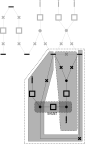

== Detect the cells

=== Definitions and goal
An object of `Cell` class represents a connected subgraph of nodes that participate to a common purpose. The goal of the cell detection is to create these subgraphs that will then:

* structures the organisation of the busbars layout
* be displayed according to their types

Two subclasses inherit the `Cell` class :

* `InternCell` for cells that does not contain `FEEDER` nodes and are not shunting `ExternCell` cells,
* `ExternCell` for cells connecting `FEEDER` nodes to `BUS` nodes.

Cells can be of one of the following enum `CellType`:

`INTERN`::
The smallest subGraph delimited by `BUS` nodes (ie not including `FEEDER`). +
Such a cell instanciates the `InternCell` subclass

`INTERNBOUND`::
A singular intern Cell having exactly 3 nodes: 1 `SWITCH` node connecting 2 neighboring (ie having the same vertical position, and having contiguous horizontal values) `BUS` nodes  +
(note that the cellDetector will detect this as `INTERN`, further processing will detect it)
Such a cell instanciates the `InternCell` subclass +

`EXTERN`::
The smallest subGraph delimited by `BUS` nodes and `FEEDER` nodes with at least one node having the following property: each branch extracted from this very node ends with nodes of a single `nodeType` among: `BUS` or `FEEDER` or `SHUNT` +
 Such a cell instanciates the `ExternCell` subclass

`SHUNT`::
A path between 2 `FictitiousNode` nodes of 2 `ExternCell` cells +
Such cell instanciates the `Cell` class

`UNDEFINED`::
Initial type, should not stay as is.

The figure shows examples of cells of each `CellType`.

.CellTypes enum

=== Implementations
==== The `ImplicitCellDetector` class
The ImplicitCellDetector implements an algorithm sticking to the above definitions.

===== Cleaning
A preliminary step consists in calling some cleaning and tuning operations of the `Graph` class.

* `Graph.removeUnnecessaryFictitiousNodes()` is _optionally_ called to simplify the graph by removing redundant `FICTITIOUS` nodes
* `Graph.extendFeederWithMultipleSwitches()` is _systematically_ called to insert a `FICTITIOUS` node to a `FEEDER` node when it is originally connected to many `SWITCH` nodes as graphically, a `FeederNode` shall be connected to one and only one node.
* `Graph.extendFirstOutsideNode()` copes with the case of a string of 2+ `SWITCH` nodes starting from a `BUS` node. In that case a `FICTITIOUS` node need to be applied to align the connection of the second `SWITCH` node at the `LayoutParameters.stackHeight`
* `Graph.extendBreakerConnectedToBus()` copes with a breaker directly connected to the `BUS` node. A fictitious switch is inserted in between.
* `Graph.extendFeederConnectedToBus()` copes with `FEEDER` node directly connected to the `BUS` node. A `FICTITIOUS` node is inserted in between.

==== Cell detection algorithm
===== Steps

The algorithm will be explained based on the following graph that would result in the figure displayed to illustrate the cellTypes enum:

.raw graph

* step 1 calls twice the `genericDetectCell` method to identify:
.. the `InternCell` cells
.. other consistent subgraphs that will be analysed in the next steps
* step 2 identifies the consistent subgraphs that are ExternCell
* step 3 tries to separates each consistent subgraph into:
** 2 `ExternCell` cells bound by
** 1 `Cell` cell constituting a shunt

Steps 1 and 3 make use of the recursive method `rDelimitedExploration` to visit the graph

CAUTION: Any other pattern is not handled by the algorithm.

===== the method `rDelimitedExploration`

`rDelimitedExploration` visits the graph and gathers each nodes of the path to constitute a connected subgraph according to criteria on nodes. Each node visited is added to the `exploredNodes` list that constitutes the list of nodes that shall not be visited again. It takes as parameter two lists of types that will delimits the traversal algorithm :

* `stopTypes` list: for types that end a current branch
* `exclusionTypes` list: for types that invalidate the current subgraph.

.Use of the `rDelimitedExploration` method
|====
|Where |ExclusionTypes |StopTypes
|Step 1 in 1^st^ `genericDetectCell` call to identify the internal cells|`FEEDER` |`BUS`
|Step 1 in 2^nd^ `genericDetectCell` call to identify other consistent subgraphs |- |`FEEDER` and `BUS`
|Step 3 to identify nodes of `SHUNT` nodes|`BUS`, `SHUNT` and `FEEDER` | -
|====

===== Step 1: Split the graph and identify `InternCell` cells
The `FEEDER` and `BUS` node types constitute borders of cells or consistent subgraphs. When the algorithm reaches one of them, it either stops the branch, or invalidates the graph traversal.

`InternCell` cells are easy to determine as being exclusively bordered by `BUS` nodes.

.step 1 and InternCell

==== Step 2: identifies `ExternCell` cells
If one node of the subgraph has each of its branches ending with one single kind of `NodeType` among `BUS` and `FEEDER`, ("_bottleneck_" node in the picture) this is an `ExternCell`.

Other `ExternCell` cells could be discovered in the next steps when adding the `SHUNT NodeType`.

.ExternCell detection

===== step 3: discriminates `EXTERN` and `SHUNT` cells
To identify the first candidate `SHUNT` node, each `FICTITIOUS` node with more than 3 branches are visited. The expected property of the `SHUNT` node is that:

. 1+ branch(s) ends with only `BUS` nodes
. 1+ branch(s) ends with only `FEEDER` nodes
. 1 branch is ends with `FEEDER` *and* `BUS` nodes.

The branches of the first two categories constitutes the first `ExternCell` cell.

Then the `SHUNT` cell is constituted of:

* the first `SHUNT` node
* the string of nodes that have only 2 adjacent nodes
* the first node with more than 2 adjacent nodes that becomes the second `SHUNT` node

Last, the second `ExternCell` cell is build with the second `SHUNT` node and the remaining nodes.

.Descrimination of a `SHUNT` cell

