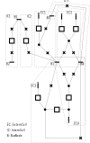
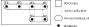

= `PositionByClustering`: Establishing positions driven by similarities

== Context
The goal of the algorithm is to find an organization of the `VoltageLevel` with no other information than the graph itself.

== Algorithm
=== Principle
The positionning is based on sequential merges of `BSCluster` considering:

* the fact that each external cells and any "leg" of an `InternCell` shall be *stackable* - meaning, that all the corresponding busbars are aligned in parallel to be able to connect them with a vertical string of isolators. This implies the `busNodes` of a leg shall be spread in different vertical structural positions. The initialization of the `VerticalBusSets` reflects this constraint.
* attractivity -- which is expressed in terms of strength of a `Link` between sides (left/right) of `BSCluster`. The stronger the link, the more likely it is to be subject to a merge.

The name of the implementation comes from the fact that `BSClusters` are absorbing one another growing clusters to a single one.

=== Steps
* `PositionByClustering::indexBusPosition` builds the `Map<BusNode, Integer> busToNb`. (The sorting order (`BusNode::getId`) only goal is to avoid randomness.)
* `PositionByClustering::organizeBusSets`:
** builds `List<BSCluster>bsClusters`
** calls `Links::create`, which creates:
*** `bsClusterSides` with all the initial `BSClusterSide` (ie `RIGHT` and `LEFT` for each `BSCluster`)
*** `linkSet` with all the feasible `Link` between them, sorted by the "strength" of their similarities
** successively:
*** merges the `BSClusterSide` of the first (and strongest) `Link`,
*** updates `bsClusterSides` list and `linkSet`. (Each merge reducing their size.)
*** until `linkSet` is empty (and `bsClusterSides` reduced to both sides of a single encompassing `BSCluster`)
** calls `tetrisHorizontalBusLists` which arranges the `HorizontalBusLists` to reduce their number, and consequently the number of necessary `busbarIndex` merging them when they don't overlap.
** transfers the resulting structure into `BusNode.busbarIndex` and `BusNode.sectionIndex`, and `ExternCell.order`.
** the remaining `BSCluster` is ready to be processed by `Subsection` class.

=== Dedicated classes

==== The `BSClusterSide` class

The `BSClusterSide` is a composition of a `BSCluster` and a `Side` (`LEFT/RIGHT`).

The `BSClusterSide` class provides methods to evaluate its contribution to the strength of a `Link` (see below).

It is necessary to make the distinction between the sides of `BSCluster` when looking for similarities for merging. Indeed, once a `BSCluster` grows and has more than one `VerticalBusSet`, the attractivity characteristics of both sides are differing. For example, one `BusNode` could be right at the edge of the `LEFT` side in a `HorizontalBusList` that has other `BusNodes` (on its right). For linking with `COMMONBUSES`, the `BusNode` will be exposed only on the `LEFT` side.

==== The `Link` class

The key principle of the algorithm relies on the fact that the `Link` class implements `Comparable`, providing a comparison of the strength of each of the 2 considered `Link`. This is established by a lexicographic comparison of grades sorted per `Category`.

The `enum Category` defines a lexicographic order of the considered kind of similarities between 2 `BSClusterSides`:

* `COMMONBUSES`
* `FLATCELLS`
* `CROSSOVER`
* `SHUNT`

The `Link` class  holds:

* 2 `BSClusterSide`,
* a map that holds the similarity grade per `Category`.

Therefore, the comparison between 2 `Link` is as follow:

* the more buses there is in common between the 2 `BSClusterSides` the greater the similarity is.
* If equal, then compare flat cells (see note below) as follow:

** 100 * number of common candidate flat cells.
** minored by the sum of the distances of each flat cell to the edge of each `BSClusterSide` (more details in the note below)

* if equal, then the number of `InternCell` that will never become flat  (and will have to cross over the layout) is compared
* if equal, then compare the attractivity of `ShuntCells` in common (ie having one `ExternCell` in each `BSClusterSide` and for which attractivity is assessed considering their distance to the considered side edge).

[NOTE]
.About flat cells
====
* At that stage, they are only considered potential flat cell which type is `CANDIDATEFLATCELL`. They will have to be confirmed as `FLATCELL` later in `Subsection`,
* The flat cells are identified when both legs are at the appropriate side of the 2 considered `BSClusterSide`, which means they are:
** at the begining of a `HorizontalBusSet` if the `BSClusterSide` is `LEFT`
** at the end if it is `RIGHT`
* For a leg, respecting this criteria does not imply the distance to the edge is 0. For example, in the case of the `LEFT` side of the `BSClusterSide`, the `BusNode` involved in the cell shall be at the beginning of its `HorizontalBusSet`, but this does not imply the starting index of the `HorizontalBusSet` to be 0. The distance to the edge is this starting index.
* The value *100* that multiplies the number of flat cells is arbitrary. It must be big enough so that the number of flat cells is fostered over the penalty of the distances to the edges. By doing so, the distance minoration discriminates only when the numbers of flat cells are the same.
====

[IMPORTANT]
.Link and side
====
* No `Link` shall be created between both `BSClusterSide` of the same `BSCluster` as it is not possible to merge them.
* Two `BSClusterSide` having the same side can have a `Link`. If they are to be merged, one will be flipped.
====

==== The `Links` class
The `Links` class holds and manages:

* `bsClusterSides`: a list of all the `BSClusterSide`
* a `TreeSet<Link>linkSet`: which stores all the `Link` feasible between the `bsClusterSides` elements. This `linkSet` is sorted accordingg to the `Comparable` implemented by `Link`.

When a Link is selected for a merge of its `BSClusterSide`, all the `Link` involving any of both `BSClusterSide` are destroyed. New `Link` are created between both (left/right) `BSClusterSide` created with the newly merged `BSCluster` and each element of `bsClusterSides`. Therefore, `linkSet` always contains an updated sorted set of all the feasible `Link`.

== Example
=== Input information
The raw graph looks:

=== Steps 
==== Step 1: Build of `VerticalBusSets`

Contrary to `PositionFromExtension` no order is necessary, let's arbitrary use the suffix in the name of the `BusNode`.

[cols="4*^"]

|===
|vbs | BusNodes(busBarIndex, sectionIndex) | ExternCells | InternCellSides

|vbs-1
|[ B1(2, 2), B3(1, 2) ]
|[ EC1 ]
|[ IC2.R, IC3.L ]

|vbs-2
|[ B1(2, 2), B4(1, 3) ]
|[ EC2, EC3, EC4 ]
|[ IC3.R ]

|vbs-3
|[ B2(2, 1) ]
|
|[ IC1.L ]

|vbs-4
|[ B5(1, 1) ]
|
|[ IC1.R, IC2.L ]

|===

==== Step 2.1: Build of unitary `BSCluster`

[cols="^1, ^2, ^1"]
|===
|BSCluster | VerticalBusSets | HorizontalBusLists

|bsc-1
|[ ( [ B1, B3 ] , [ EC1 ] , [ IC2.R, IC3.L ] ) ]
|[ [ B1(2, 2) ] , [ B3(1, 2) ] ]

|bsc-2
|[ ( [ B1, B4 ] , [ EC2, EC3, EC4 ] , [ IC3.R ] ) ]
|[ [ B1(2, 2) ], [ B4(1, 3) ] ]

|bsc-3
|[ ( [ B2 ] , , [ IC1.L ] ) ]
|[ [ B2(2, 1) ] ]

|bsc-4
|[ ( [ B5 ] , , [ IC1.R , IC2.L ] ) ]
|[ [ B5(1, 1) ] ]

|===

==== Step 2.2: Build the list of `BSClusterSide` and link them

Here is a list of all the `Link` that are created with the original list of `BSCluster`, and the grade assessed per `Category`.

[cols="6*^"]
|===
|BSClusterSide1|BSClusterSide2|Common Buses|Flat cells|Crossover|Shunt

|bsc-1.L|bsc-2.L|[B1]-> *1* |[IC3]-> 100*1 = *100* | 0 | 0
|bsc-1.L|bsc-2.R|[B1]-> *1* |[IC3]-> 100*1 = *100* | 0 | 0
|bsc-1.R|bsc-2.L|[B1]-> *1* |[IC3]-> 100*1 = *100* | 0 | 0
|bsc-1.R|bsc-2.R|[B1]-> *1* |[IC3]-> 100*1 = *100* | 0 | 0
|bsc-1.L|bsc-3.L|*0* |*0* | 0 | 0
|bsc-1.L|bsc-3.R|*0* |*0* | 0 | 0
|bsc-1.R|bsc-3.L|*0* |*0* | 0 | 0
|bsc-1.R|bsc-3.R|*0* |*0* | 0 | 0
|bsc-1.L|bsc-4.L|*0* |[IC2]-> 100*1 = *100* | 0 | 0
|bsc-1.L|bsc-4.R|*0* |[IC2]-> 100*1 = *100* | 0 | 0
|bsc-1.R|bsc-4.L|*0* |[IC2]-> 100*1 = *100* | 0 | 0
|bsc-1.R|bsc-4.R|*0* |[IC2]-> 100*1 = *100* | 0 | 0
|bsc-2.L|bsc-3.L|*0* |*0* | 0 | 0
|bsc-2.L|bsc-3.R|*0* |*0* | 0 | 0
|bsc-2.R|bsc-3.L|*0* |*0* | 0 | 0
|bsc-2.R|bsc-3.R|*0* |*0* | 0 | 0
|bsc-2.L|bsc-4.L|*0* |*0* | 0 | 0
|bsc-2.L|bsc-4.R|*0* |*0* | 0 | 0
|bsc-2.R|bsc-4.L|*0* |*0* | 0 | 0
|bsc-2.R|bsc-4.R|*0* |*0* | 0 | 0
|bsc-3.L|bsc-4.L|*0* |[IC1]-> 100*1 = *100*  | 0 | 0
|bsc-3.L|bsc-4.R|*0* |[IC1]-> 100*1 = *100*  | 0 | 0
|bsc-3.R|bsc-4.L|*0* |[IC1]-> 100*1 = *100*  | 0 | 0
|bsc-3.R|bsc-4.R|*0* |[IC1]-> 100*1 = *100*  | 0 | 0
|===

Let's remove the unnecessary fields for the example (Crossover and Shunt) and sort the table according to the `Link` order.

[cols="4*^"]
|===
|BSClusterSide1|BSClusterSide2|Common Buses|Flat cells

|bsc-1.L|bsc-2.L|[B1]-> *1* |[IC3]-> 100*1 = *100*
|bsc-1.L|bsc-2.R|[B1]-> *1* |[IC3]-> 100*1 = *100*
|bsc-1.R|bsc-2.L|[B1]-> *1* |[IC3]-> 100*1 = *100*
|bsc-1.R|bsc-2.R|[B1]-> *1* |[IC3]-> 100*1 = *100*
|bsc-3.L|bsc-4.L|*0* |[IC1]-> 100*1 = *100*
|bsc-3.L|bsc-4.R|*0* |[IC1]-> 100*1 = *100*
|bsc-3.R|bsc-4.L|*0* |[IC1]-> 100*1 = *100*
|bsc-3.R|bsc-4.R|*0* |[IC1]-> 100*1 = *100*
|bsc-1.L|bsc-4.L|*0* |[IC2]-> 100*1 = *100*
|bsc-1.L|bsc-4.R|*0* |[IC2]-> 100*1 = *100*
|bsc-1.R|bsc-4.L|*0* |[IC2]-> 100*1 = *100*
|bsc-1.R|bsc-4.R|*0* |[IC2]-> 100*1 = *100*
|bsc-1.L|bsc-3.L|*0* |*0*
|bsc-1.L|bsc-3.R|*0* |*0*
|bsc-1.R|bsc-3.L|*0* |*0*
|bsc-1.R|bsc-3.R|*0* |*0*
|bsc-2.L|bsc-3.L|*0* |*0*
|bsc-2.L|bsc-3.R|*0* |*0*
|bsc-2.R|bsc-3.L|*0* |*0*
|bsc-2.R|bsc-3.R|*0* |*0*
|bsc-2.L|bsc-4.L|*0* |*0*
|bsc-2.L|bsc-4.R|*0* |*0*
|bsc-2.R|bsc-4.L|*0* |*0*
|bsc-2.R|bsc-4.R|*0* |*0*
|===

==== Step 3: Merge of `BSClusters` into a single one
At the first iteration, the `Link` between *bsc-1.L* and *bsc-2.L* is the strongest. Let's merge them into *bsc-12*:

[cols="^.^1, ^.^2, ^.^1"]
|===
|BSCluster | VerticalBusSets | HorizontalBusLists

|bsc-12 = bsc1 + bsc2
|[ ( [ B1, B3 ] , [ EC1 ] , [ IC2.R, IC3.L ] ),

( [ B1, B4 ] , [ EC2, EC3, EC4 ] , [ IC3.R ] )
 ]
|[ [ B1(2, 2) , B1(2, 2) ],

[ B3(1, 2), B4(1, 3) ] ]

|bsc-3
|[ ( [ B2 ] , , [ IC1.L ] ) ]
|[ [ B2(2, 1) ] ]

|bsc-4
|[ ( [ B5 ] , , [ IC1.R , IC2.L ] ) ]
|[ [ B5(1, 1) ] ]

|===

[NOTE]
.regarding the merge
====
* *B1* is common to both, and therefore *B1* spans over 2 indexes in its resulting `HorizontalBusList`
* *IC3* links *B3* and *B4* so they are merged in the same `HorizontalBusList`
====

Let's update the list of `Link`.

[cols="4*^"]
|===
|BSClusterSide1|BSClusterSide2|Common Buses|Flat cells

|bsc-3.L|bsc-4.L|*0* |[IC1]-> 100*1 = *100*
|bsc-3.L|bsc-4.R|*0* |[IC1]-> 100*1 = *100*
|bsc-3.R|bsc-4.L|*0* |[IC1]-> 100*1 = *100*
|bsc-3.R|bsc-4.R|*0* |[IC1]-> 100*1 = *100*
|bsc-12.L|bsc-4.L|*0* |[IC2]-> 100*1 = *100*
|bsc-12.L|bsc-4.R|*0* |[IC2]-> 100*1 = *100*
|bsc-12.R|bsc-4.L|*0* |[IC2]-> 100*1 = *100*
|bsc-12.R|bsc-4.R|*0* |[IC2]-> 100*1 = *100*
|bsc-12.L|bsc-3.L|*0* |*0*
|bsc-12.L|bsc-3.R|*0* |*0*
|bsc-12.R|bsc-3.L|*0* |*0*
|bsc-12.R|bsc-3.R|*0* |*0*
|===

Now the strongest link is between *bsc-3.L* and *bsc-4.L*. Let's merge them into *bsc-34*:

[cols="^.^1, ^.^2, ^.^1"]
|===
|BSCluster | VerticalBusSets | HorizontalBusLists

|bsc-12 = bsc1 + bsc2
|[ ( [ B1, B3 ] , [ EC1 ] , [ IC2.R, IC3.L ] ),

( [ B1, B4 ] , [ EC2, EC3, EC4 ] , [ IC3.R ] )]

|[ [ B1(2, 2) , B1(2, 2) ],

[ B3(1, 2), B4(1, 3) ] ]

|bsc-34 = bsc3 + bsc4
|[ ( [ B2 ] , , [ IC1.L ] ),

( [ B5 ] , , [ IC1.R , IC2.L ] ) ]
|[ [ B2(2, 1), B5[1, 1]] ]

|===

[cols="4*^"]
|===
|BSClusterSide1|BSClusterSide2|Common Buses|Flat cells

|bsc-12.L|bsc-34.R|*0* |[IC2]-> 100*1 = *100*
|bsc-12.R|bsc-34.R|*0* |[IC2]-> 100*1 = *100*
|bsc-12.L|bsc-34.L|*0* |*0*
|bsc-12.R|bsc-34.L|*0* |*0*
|===

*IC2* is what makes the strongest link. It is on the `RIGHT` side of *bsc-34*, and in its `HorizontalBuslList` *B3* is on its left, therefore *IC2* is not visible from the `LEFT` side, which explains why the flat cell grade is 0 for the last 2 `Link`.

*Final merge*: *bsc-12.L* with *bsc-34.R* that will become *bsc-3412* as the right side of *bs-34* is connected to the left side of *bsc-12*. (Reminder, when merging 2 `BSClusterSide` having the same side, one is to be flipped -- which is actually not necessary here.)

[cols="^.^1, ^.^2, ^.^1"]
|===
|BSCluster | VerticalBusSets | HorizontalBusLists

|bsc-3412 = bsc34 + bsc12
|[ ( [ B2 ] , , [ IC1.L ] ),

( [ B5 ] , , [ IC1.R , IC2.L ] ),

( [ B1, B3 ] , [ EC1 ] , [ IC2.R, IC3.L ] ),

( [ B1, B4 ] , [ EC2, EC3, EC4 ] , [ IC3.R ] ) ]

|[ [ B2(2, 1), B5[1, 1], B1(2, 2) , B1(2, 2)],

[ . , . , B3(1, 2), B4(1, 3) ] ]

|===

Note that the second `HorizontalBusSet` starts with index 2.

No "tetrissing" will be required as the final arrangement is directly correct.

This results in:

==== Step 4: Build of the `List<Subsection>subsections`
Done by calling `Subsection::createSubsections`. See link:Subsection.adoc[Subsection].

=== Final result

