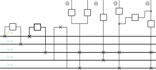
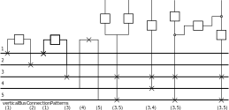

== Position of the Bus nodes and cells order
=== Definitions and goal
Positioning the bus nodes and determination of the external cells order are performed by implementing `PositionFinder` interface.

The goal is to set:

* the horizontal and vertical *structural _(h,v)_* `Position` of the bus nodes: `NodeBus.structuralPosition`
* the horizontal order of the cells: `Cell.order`

The figure hereafter shows the information that are to be established.

.(h,v) positions of busbars and `ExternCell` cells order
image::images/busbars.svg[align="center"]

The above structure will be used to explain the different steps of the positioning algorithms.

This information can be

* explicitly given (for example to reflect the on site real structure and/or the way the SCADA organises it). One implementation is the `PositionFromExtension` class
* or automatically to fit some layout criteria. One implementation is the `PositionFree` class

=== Implementations
==== PositionFromExtension: explicit configuration
The `PositionFromExtension` takes the information from the `iidm` extension.
It is gathered:

* in `Graph.visitBusbarSection()` when building the graph for the NodeBus positions
* and completed in `PositionFromExtension.gatherLayoutExtensionInformation()` for the feeders' order, in which the `Cell.orderFromFeederOrders()` is called to determine the order of the cell.

==== The `PositionFree` class
The goal of the algorithm is to find an organization of the `VoltageLevel` with no other information that the graph itself. This is a "free" positioning since no constraints are given from a configuration source.

The key criteria that is followed to find a suitable organisation is the fact that each external cells, and any "leg" of an internal cell can be "stacked" - meaning, that all the corresponding busbars are aligned in parallel to be able to connect them with a vertical string of isolators. (This criteria applies only when the structure of the cell allows it - which may not not the case)

A straightforward approach to this criteria would lead to the following structure, that the algorithm will try to reduce.

.Raw positionning (the information in gray are not known and will be established by the algorithm)

===== Gathering `VerticalBusConnectionPattern` elements
`VerticalBusConnectionPattern` is na inner class that represents the connection pattern to the busbars as a set of `busNode` for:

* an external cell
* or a leg of an intern cell.

Let's call them indistinctly as *cell leg*.

.verticalBusConnectionPattern of cell legs

This enables to gather all the cell legs having the same pattern as they share the same organisation constraint.

The possible `VerticalBusConnectionPatterns` are gathered as the key of the `vbcpToCells` map, the value being the list of `ExternCell` cells having this pattern (no need to gather internal cells).

When the `vbcpToCells` map is built, if a pattern is fully included or fully embraces an already existing `vbcp`, they are merged into the embracing one. For example, the pattern (3) is included in the pattern (3,5).

CAUTION: Different merges of vbcp can occurs if the structure is not visited in the same order: for example if 3 external cells have (1,2) (1,3) and (1) as vbcp: the cell having the vbcp (1) could be included either into the (1,2) or (1,3) vbcp.

===== Structuring with internal cells
If the two legs of an internal cell are fully included into a single known vbcp, then this cell is considered as vertical and is not structuring. Indeed, one cell leg already constraints all the busbars of the cell to be parallel.

This would lead to:

.vbcpToCell
|===
| vbcp | External Cells

|(1) | -
|(2) | -
|(3,4) | 1 External cells
|(3,5) | 3 External cells
|===

Therefore the algorithm works on structuring cells that are the ones that are not vertical.

Among these structuring cells, the algorithm will look for candidate flat cells (reminder: a flat cell is a 3-node cell having the `BUS-SWITCH-BUS` pattern for which the two buses have the same vertical position, and have contiguous horizontal positions).

Then it will chain the `BUS` nodes with the `candidateFlatCell` into `HorizontalChain` objects.

`VerticalBusConnectionPattern` class::
qsd
`VerticalBusConnectionPattern` class::
qsd
