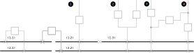
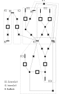
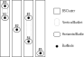

== Position of `BusNodes` and `Cells` order
=== Definitions and goal
Positioning the bus nodes and determination of the external cells order are performed by implementing `PositionFinder` interface.

The goal is to set:

* the horizontal and vertical *structural _(h,v)_* `Position` of the bus nodes: `NodeBus.structuralPosition`
* the horizontal *order* of the cells: `Cell.order`

The picture hereafter shows the information that are to be established. But actually, the outcome of `PositionFinder` is delivered another way, throug a coherent `List<Subsection>`. See link:Subsection.adoc[Subsection]

.(h,v) positions of `BusNodes` and `ExternCell` cells order

=== Available implementations
Two implementations are available:

* `PositionFromExtension` which rely on explicitly given positions (for example to reflect the on-site real structure and/or the way the SCADA organises it). See link:PositionFromExtension.adoc[PositionFromExtension]
* `PositionByClustering` which finds an organization of the `VoltageLevel` with no other information than the graph itself. See link:PositionByClustering[PositionByClustering]

Both rely on the `BSCluster`. See link:BSCluster.adoc[BSCluster]

=== Illustration of algorithms based on `BSCluster`
The illustration will be based on the following graph and shall result in the above layout.

==== step 1: Build `VerticalBusSets`
The result of `VerticalBusSet.createVerticalBusSets` is

[cols="1,1,1,1"]
|===
|VerticalBusSet |BusNodes | ExternCells | InternCellSides

|vbs-1
|B3, B1
|EC1
|IC2.R, IC3.L

|vbs-2
|B2
|
|IC1.L

|vbs-3
|B1, B4
|EC2, EC3, EC4
|IC3.R

|vbs-4
|B5
|
|IC1.R, IC2.L

|===

[NOTE]
At that stage, the `LEFT` and `RIGHT` side of an `IntenCell` is arbitrary. They will be flipped if necessary later on (handled in `Subsection.createSubsections`).

==== step 2: Build unitary `BSClusters`
This consist in creating one `BSCluster` per `VerticalBusSet`. This results in:

[cols=".^1, .^2, 1"]
|===
|BSCluster | VerticalBusSets | HorizontalBusSets

|bsc-1
|[vbs-3: [B3, B1], [EC1], [IC2.R, IC3.L]]
|[hbl-3: [B3],

hbl-4: [B1]]

|bsc-2
|[vbs-1: [B2], , [IC1.L]]
|[hbl-1: [B2]]

|bsc-3
|[vbs-4: [B1, B4], [EC2, EC3, EC4] , [IC3.R]]
|[hbl-5: [B1],

hbl-6: [B4]]

|bsc-4
|[vbs-2: [B5], , [IC1.L, IC2.L]]
|[hbl-2: [B5]]

|===

==== step 3: Merge `BSClusters` into a single one
That's where the magic happens. This is where the implementations mainly differ. The goal is to merge the `BSClusters` to one another.

The principle of the merging of a `BSCluster` are:

- simply concat the `VerticalBusSet` List
- merge the `HorizontalBusSet`
 
This should result in 

==== step 4: Build the `List<Subsection>`