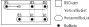

= `PositionFromExtension`: Position from an explicit configuration

== Context
`PositionFromExtension` implements link:PositionFinder.adoc[PositionFinder] and takes the information from the `iidm` extension to organize `BSClusters`.
 When building the `VoltageLevelGraph`, `NetworkGraphBuilder` retrieves and sets:

* `BusNode.busbarIndex` and `BusNode.sectionIndex`, 
* `FeederNode.order` which is used to define `ExternCells::getOrder`

== Algorithm
=== Principle
The algorithm considers that the positional information given (by the *iidm* extension) is coherent. Sorting orders are defined based on this information and are used when building `VerticalBusSets` and `BSClusters`. These objects can then be arranged relying on the consistency inherited from the given coherent orders.

The algorithm may sound not straightforward, but that approach eases the elaboration of the next step (building of `List<Substation>`), and naturally addresses the constraints raised by non horizontaly symetrical arrangements of `BusNodes` (case developed in example below).

=== Steps
`PositionFromExtension::organizeBusSets`:

- builds the `Map<BusNode, Integer> busToNb` by calling `PositionFromExtension::indexBusPosition`,
- builds `List<BSCluster>bsClusters` by providing the list of initial `VerticalBusSet` sorted by the comparator `VBSCOMPARATOR`
- merges `bsClusters` sequentially by merging the first `BSCluster` of the list with the second until only one remain.

==== Sorting the `BusNodes` of the `VerticalBusSets`
This sorting order foster `busbarIndex` reflecting the *vertical view* of the structure.

The algorithm rely on the fact that
`PositionFromExtension::indexBusPosition` sorts the `BusNodes` by their `busbarIndex` (first, and then by their `sectionIndex`). In `PositionFromExtension`, this order will never be modified later on, ensuring the lower the `busbarIndex` is, the higher it will be vertically laid out.

For example,

* if `BusNode` *A* has a lower `busBarIndex` than the one of *B*,
* *A* will be before *B* in a `VerticalBusSet`, 
* *A* will be laid out above *B*.

==== Sorting the `bsClusters` 
This sorting order foster `sectionIndex` reflecting the *horizontal view* of the structure.

`VBSCOMPARATOR` is designed to sort the given `List<VerticalBusSet>verticalBusSet` using the positional information given by the extension. It sorts:

* *First and most important sorting rule*: compare `sectionIndex` (which corresponds to horizontal order) of `BusNodes` having the same `busbarIndex`. ie:
** Match a pair of `BusNodes` having the same `busbarIndex`, taken in:
*** the right side of the first `BSCluster`
*** the left side of the second `BSCluster`.
** If they have different `BusNode.sectionIndex`, *return* the difference
** if they are equal, then try again with another pair.
* *Else*, compare `BusCell::getOrder` of `BusCells` in both `VerticalBusSets`
* *Else*, some rules, to ensure uniqueness.

==== Merging
The merging process consists in repeating the merging of the first `BSCluster` with the second one until only one remains.

`HorizontalBusListManager::mergeHbl` merges the `HorizontalBusLists` from the 2 `BSClusters` by concatenating them when they have the same `busbarIndex`. As the `BSClusters` si sorted by `busbarIndex`, there is a coherent progression in each merged `HorizontalBusList`.

== Example
=== The end in mind
The picture hereafter shows what we expect to display. The complete information from the extension is given.

.(h,v) positions of `BusNodes` and `ExternCell` cells order
image::images/busbars.svg[align="center"]

=== Input information
The raw graph looks:

image::images/rawGraphVBS.svg[align="center"]

For which the information is represented as follow:

[ cols="2*^" ]
|===
|raw Bus id | (busbarIndex, sectionIndex)

| B1 | (2, 2)
| B2 | (2, 1)
| B3 | (1, 2)
| B4 | (1, 3)
| B5 | (1, 1)
|===

And the `ExternalCell` `order` of *ECx* is *x*.

=== Steps 
==== Step 1: Build of `VerticalBusSets`

First we define the `Map<BusNode, Integer> busToNb` according to the sorting order `(busbarIndex, sectionIndex)`: *vertical sorting*.

[ cols="3*^" ]
|===
|raw Bus id | Nb | (busbarIndex, sectionIndex)

| B5 | 1 | (1, 1)
| B3 | 2 | (1, 2)
| B4 | 3 | (1, 3)
| B2 | 4 | (2, 1)
| B1 | 5 | (2, 2)
|===

Now `VerticalBusSet.createVerticalBusSets` will create the `VerticalBusSet` and they will be sort it according to `VBSCOMPARATOR`: *horizontal sorting*.

[cols="4*^"]

|===
|vbs | BusNodes(busBarIndex, sectionIndex) | ExternCells | InternCellSides

|vbs-1
|[ B5(1, 1) ]
|
|[ IC1.R, IC2.L ]

|vbs-2
|[ B2(2, 1) ]
|
|[ IC1.L ]

|vbs-3
|[ B3(1, 2), B1(2, 2) ]
|[ EC1 ]
|[ IC2.R, IC3.L ]

|vbs-4
|[ B4(1, 3), B1(2, 2) ]
|[ EC2, EC3, EC4 ]
|[ IC3.R ]

|===

Note the position of *vbs-2*, as *B2(2,1)* shall be before *B1(2,2)*.

==== Step 2: Build of unitary `BSClusters`

This consist in creating one `BSCluster` per `VerticalBusSet`. This results in:

[cols="^1, ^2, ^1"]
|===
|BSCluster | VerticalBusSets | HorizontalBusLists

|bsc-1
|[ ( [ B5 ] , , [ IC1.L , IC2.L ] ) ]
|[ [ B5(1, 1) ] ]

|bsc-2
|[ ( [ B2 ] , , [ IC1.L ] ) ]
|[ [ B2(2, 1) ] ]

|bsc-3
|[ ( [ B3, B1 ] , [ EC1 ] , [ IC2.R, IC3.L ] ) ]
|[ [ B3(1, 2) ] , [ B1(2, 2) ] ]

|bsc-4
|[ ( [ B1, B4 ] , [ EC2, EC3, EC4 ] , [ IC3.R ] ) ]
|[ [ B1(2, 2) ], [ B4(1, 3) ] ]

|===

==== Step 3: Merge of `BSClusters` into a single one

[cols="^.^1, ^.^2, ^.^2"]
|===
|BSCluster | VerticalBusSets | HorizontalBusLists

|bsc-12

= bsc-1 + *bsc-2*

| [ ( [ B5 ] , , [ IC1.L , IC2.L ] ), 

*( [ B2 ] , , [ IC1.L ] )* ] 

| [ [ B5(1,1) ],

*[ B2(2,1) ]* ]

|bsc-123

= bsc-12 + *bsc-3*

| [ ( [ B5 ] , , [ IC1.L , IC2.L ] ), 

( [ B2 ] , , [ IC1.L ] ),

*( [ B3, B1 ] , [ EC1 ] , [ IC2.R, IC3.L ] )* ]

| [ [ B5(1,1), *B5(1,1), B3(1,2)* ],

[ B2(2,1), *B1(2,2)* ] ]

|*Resulting BSCluster*

bsc-1234

= bsc-123 + *bsc-4*

| [ ( [ B5 ] , , [ IC1.L , IC2.L ] ), 

( [ B2 ] , , [ IC1.L ] ),

( [ B3, B1 ] , [ EC1 ] , [ IC2.R, IC3.L ] ),

( *[ B1, B4 ] , [ EC2, EC3, EC4 ] , [ IC3.R ] )* ]

| [ [ B5(1,1), B5(1,1), B3(1,2), *B4(1,3)* ],

[ B2(2,1), B1(2,2), *B1(2,2)* ] ]

|===

This results in:

[NOTE]
.On the merge of *bsc-1 + bsc-2*:
====
* *bsc-1* and *bsc-2* have only one `NodeBus` in their `VerticalBusSet`. The parallelization of both will be handled by `Subsection::createSubsections` by an absorption mechanism.
* in its `HorizontalBusList`, *B5* is replicated until a change occurs, but this replication has no impact on the `VerticalBusSet` (ie *[ B2 ]* is not extended to *[ B5, B2 ]*).
* `HorizontalBusList` has a `startingIndex` which implies it does not necessarily align on the left side. That's the case of the second one for which the `startingIndex` is 2.
====

==== Step 4: Build of the `List<Subsection>subsections`
Done by calling `Subsection::createSubsections`. See link:Subsection.adoc[Subsection].